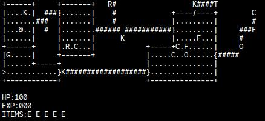

# qr

> NetHack-like game that fits in less than 3 kb.

## Table of Contents

* [General Info](#general-information)
* [Technologies Used](#technologies-used)
* [Features](#features)
* [Screenshots](#screenshots)
* [Setup](#setup)
* [Usage](#usage)
* [Project Status](#project-status)
* [Room for Improvement](#room-for-improvement)
* [Acknowledgements](#acknowledgements)
* [License](#license)

## General Information

* Console rogue-like RPG adventure game ~~with co-operative~~ that can be transferred via QR code.

## Technologies Used

<!--
GNU Make 4.4.1
Built for x86_64-pc-linux-gnu
Copyright (C) 1988-2023 Free Software Foundation, Inc.
License GPLv3+: GNU GPL version 3 or later <https://gnu.org/licenses/gpl.html>
This is free software: you are free to change and redistribute it.
There is NO WARRANTY, to the extent permitted by law.
-->
* GNU Make 4.4.1
<!--
GNU bash, version 5.3.3(1)-release (x86_64-pc-linux-gnu)
Copyright (C) 2025 Free Software Foundation, Inc.
License GPLv3+: GNU GPL version 3 or later <http://gnu.org/licenses/gpl.html>

This is free software; you are free to change and redistribute it.
There is NO WARRANTY, to the extent permitted by law.
-->
* GNU bash 5.3.3
<!--
GNU objcopy (GNU Binutils) 2.45.0
Copyright (C) 2025 Free Software Foundation, Inc.
This program is free software; you may redistribute it under the terms of
the GNU General Public License version 3 or (at your option) any later version.
This program has absolutely no warranty.
-->
* GNU objcopy (GNU Binutils) 2.45.0
<!--
GNU strip (GNU Binutils) 2.45.0
Copyright (C) 2025 Free Software Foundation, Inc.
This program is free software; you may redistribute it under the terms of
the GNU General Public License version 3 or (at your option) any later version.
This program has absolutely no warranty.
-->
* GNU strip (GNU Binutils) 2.45.0
<!--
clang version 20.1.8
Target: x86_64-pc-linux-gnu
Thread model: posix

Part of the LLVM Project, under the Apache License v2.0 with LLVM Exceptions.
See https://llvm.org/LICENSE.txt for license information.
-->
* clang 20.1.8

## Features

* ~~2 players co-operative.~~
* Character leveling.
* Different type items.
* Different type opponents.
* Map recognizing on start-up.

## Screenshots

## Usage

build.sh used to build the project.

## Project Status

Project is: _in progress_.

## Room for Improvement

To do:

* 2 players cooperative.
* Random map generation.

## Acknowledgements

* This project was inspired by [_NetHack_](https://github.com/NetHack/NetHack)
* This project was based on [_this tutorial_](https://www.youtube.com/watch?v=DfA2BKPOhCA)
* Many thanks to [_zergon321_](https://github.com/zergon321) and [_arsenez1999_](https://github.com/arsenez2006)

## License

This project is open source and available under the [GNU Affero General Public License v3.0](LICENSE).
