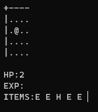

# qr

> NetHack-like game that fits in less than 3 kb.

## Table of Contents

* [General Info](#general-information)
* [Technologies Used](#technologies-used)
* [Features](#features)
* [Screenshots](#screenshots)
* [Setup](#setup)
* [Usage](#usage)
* [Project Status](#project-status)
* [Room for Improvement](#room-for-improvement)
* [Acknowledgements](#acknowledgements)
* [License](#license)

## General Information

* Console rogue-like RPG adventure game with co-operative that can be transferred via QR code.

## Technologies Used

<!--
Crinkler - compressing linker for Windows
Copyright (c) 2005-2020 Aske Simon Christensen and Rune L. H. Stubbe.

This software is provided 'as-is', without any express or implied
warranty. In no event will the authors be held liable for any damages
arising from the use of this software.

Permission is granted to anyone to use this software for any purpose,
including commercial applications, and to alter it and redistribute it
freely, subject to the following restrictions:

1. The origin of this software must not be misrepresented; you must not
   claim that you wrote the original software. If you use this software
   in a product, an acknowledgment in the product documentation would be
   appreciated but is not required.
2. Altered source versions must be plainly marked as such, and must not be
   misrepresented as being the original software.
3. This notice may not be removed or altered from any source distribution.
-->
* Crinkler - version 2.3
* gtest - version 1.11.0-3

## Features

* 2 players co-operative.
* Characters leveling.
* Different type items.
* Different type enemies.
* Map recognizing on start-up.

## Screenshots

## Setup

Get [_Crinkler_](https://crinkler.net).
Get **googletest** library.
> For **Debian/ Ubuntu**:
`apt install libgtest-dev`

## Usage

Run one of batch script files or [_Crinkler manual_](https://github.com/runestubbe/Crinkler/blob/master/doc/manual.txt).

## Project Status

Project is: _in progress_.

## Room for Improvement

Room for improvement:

* Reduce size.
* Reduce RAM usage.
* Improve code quality.

To do:

* Random map generation.
* Level to level transition.
* Progress save.
* Sounds.
* Unix support.

## Acknowledgements

* This project was inspired by [_NetHack_](https://github.com/NetHack/NetHack)
* This project was based on [_this tutorial_](https://www.youtube.com/watch?v=DfA2BKPOhCA)
* Many thanks to [_zergon321_](https://github.com/zergon321) and [_arsenez1999_](https://github.com/arsenez1999)

## License

This project is open source and available under the [GNU General Public License v3.0](https://github.com/lurkydismal/qr/blob/main/LICENSE).
